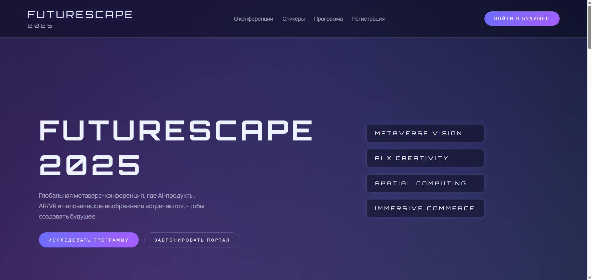

# FutureScape 2025 Landing

Интерактивный лендинг метаверс-конференции FutureScape 2025. Проект полностью статический: HTML, CSS и JavaScript.

## Автономный запуск в Docker

Создан Docker-образ на базе Nginx, включающий все необходимые статические файлы. Для локального просмотра выполните:

```bash
docker build -t futurescape2025 .
```

Запустите контейнер с автоматическим удалением после остановки:

```bash
docker run --rm -p 8080:80 futurescape2025
```

Сайт будет доступен по адресу [http://localhost:8080](http://localhost:8080). Остановите контейнер с помощью `Ctrl+C`; благодаря флагу `--rm` он будет удалён автоматически.

## Структура

- `index.html` — основной HTML-файл.
- `styles.css` — глобальные стили с неоновыми эффектами.
- `scripts/` — JavaScript, включая WebGL-сцену, анимации и интерактивные компоненты.

## Презентация



## Лицензия

Проект распространяется под лицензией MIT (см. `LICENSE`).
